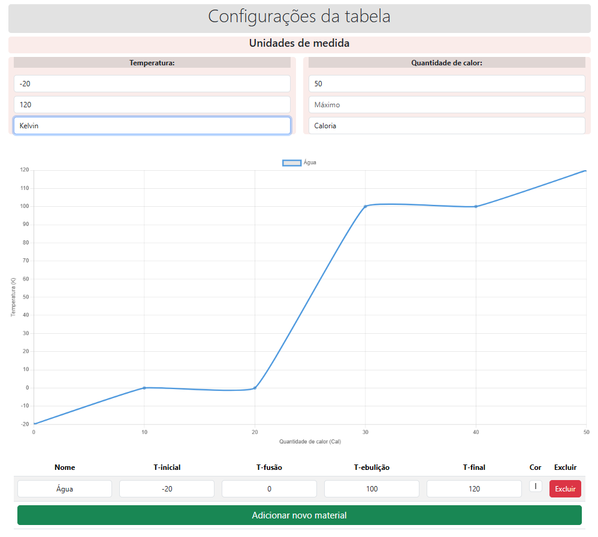

# Simulador de calor sensível e latente



Pode ser acessado [clicando este link](https://mpcardonix.github.io/simulador-fisica/)

## Contém:

- Gráfico customizável que demonstra a quantidade de calor em relação a temperatura
-  Explicações didáticas acerca do conteúdo relacionado
- Customização de materiais a serem representados no gráfico
```
class MaterialGraph(){
	name="Água"
	tInicial = -20 		#ponto inicial do gráfico
	tFusao = 0
	tEbulicao = 100
	tFinal = 120 		#ponto final do gráfico
	color = this.getRandomColor()
}
```
  

## Ideias que podem ser implementadas em futuras atualizações:

- Validação para temperatura Kelvin não ter valor negativo